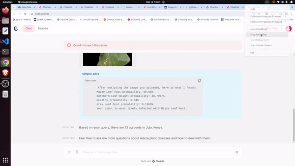

# farm-assistant

## Overview
An application that helps farmers monitor the health level of their crops.

<p align=center>
  
</p>

## Getting Started

You will need an openai API key, a Google Maps API key and the trained model. You can dowload the model at this [Google Drive](https://drive.google.com/file/d/1SKRPurbYr31-7cfCIq3IRkIHN783axpK/view?usp=sharing).

1. Clone the project repo:

  ```sh
  git clone https://github.com/twyle/farm-assistant.git
  ```

2. Navigate to the project directory, then create the project secrets, a ``.env`` file:

  ```sh
  cd farm-assistant
  touch .env
  ```

  And then paste the following:
  ```sh
    GOOGLE_MAPS_API_KEY=
    OPENAI_API_KEY=
    MODEL_PATH=
  ```

3. Install the project dependancies:
  ```sh
  pip install -r requirements.txt
  ```

4. Start the application:
  ```sh
  chainlit run farm_agent.py
  ```

The application will open up a browser window.